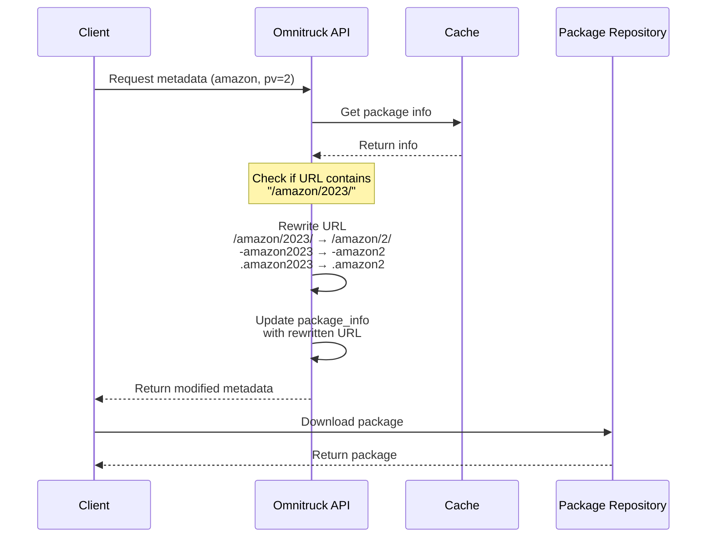

# Architectural Decision Record (ADR)

## June 3, 2025: Amazon Linux 2 URL Rewriting for Chef 18.7.10 Packages, and Chef Server remap from EL to Amazon 2 version 15.10.12. 

### Context

The Omnitruck API service provides package metadata and download URLs for Chef Software products across various platforms. When handling requests for Chef Infra on Amazon Linux 2, the service was incorrectly returning URLs for Amazon Linux 2023 packages, causing installation failures. We orginally had to make the change for when chef server started using amazon2, which produced a package of chef-server-core-15.10.12-1.amazon2.x86_64.rpm vs chef-server-core-15.10.12-1.el7.x86_64.rpm.

The issue occurred because:

1. The backend package repository stores Chef 18.7.10 packages for Amazon Linux 2 using the EL7 path format
2. Requests for Amazon Linux 2 (pv=2) were attempting to access packages using the Amazon Linux 2023 path structure
3. This mismatch caused incorrect metadata to be returned to clients

### Decision

We implemented a URL rewriting solution in the `/metadata` endpoint of `app.rb`. This approach:

1. Identifies when a request is specifically for Amazon Linux 2 (pv=2)
2. Checks if the returned URL incorrectly contains "/amazon/2023/" 
3. When both conditions are true, performs these replacements:
   - `/amazon/2023/` → `/amazon/2/` in the URL path
   - `-amazon2023` → `-amazon2` in the filename
   - `.amazon2023` → `.amazon2` in the file extension
4. Updates the package_info hash with the rewritten URL before returning to the client

### Implementation

```ruby
# Check if the URL needs to be rewritten for Amazon Linux 2
if original_url.include?("/amazon/2023/") && params[:pv] == "2"
  # Rewrite the URL for Amazon Linux 2
  rewritten_url = original_url
                    .gsub(/\/amazon\/2023\//, "/amazon/2/")
                    .gsub(/-amazon2023/, "-amazon2")
                    .gsub(/.amazon2023/, ".amazon2")
  # Update the package_info with the rewritten URL
  package_info["url"] = rewritten_url
  # Debug output of the rewritten URL
  puts "Debug Info - Rewritten Metadata URL: #{rewritten_url}"
end
```

### Sequence Diagram



### Benefits

1. **Targeted Fix**: The solution only affects requests for Amazon Linux 2, leaving all other platform requests untouched
2. **Non-Invasive**: Implementation sits at the response layer, requiring no changes to caching logic or backend data structures
3. **Maintainable**: Simple, clear logic that's easy to understand and modify if needed
4. **Observable**: Debug logging helps with troubleshooting and confirms when URL rewriting occurs

### Alternative Solutions Considered

1. **Backend Repository Restructuring**: Reorganize package repositories to match expected URLs. Rejected due to complexity and potential to break existing functionality.

2. **Manifest Modification**: Directly modify manifest data before caching. Rejected because it would affect all users of the manifest, not just this specific use case.

3. **Custom Package Info Class**: Create a specialized class for handling Amazon Linux 2 cases. Rejected as overly complex for this specific issue.

### Future Considerations

1. This solution handles the immediate issue with Chef 18.7.10 on Amazon Linux 2, but a more comprehensive solution might be needed if similar issues arise for other packages or platforms.

2. Consider formalizing platform aliasing or path translation as part of the core Omnitruck functionality rather than specialized endpoint logic.

3. Implement more comprehensive logging and monitoring for URL rewriting to track usage patterns and potential issues.