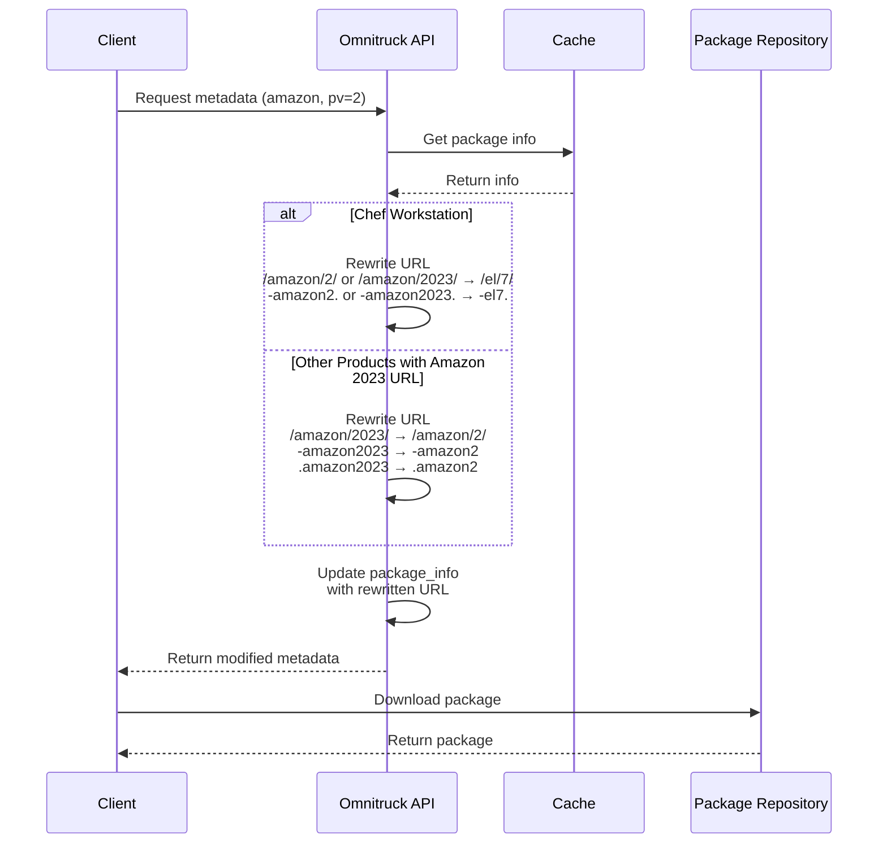

# Architectural Decision Record (ADR)

## June 3, 2025: Amazon Linux 2 URL Rewriting for Chef 18.7.10 Packages, and Chef Server remap from EL to Amazon 2 version 15.10.12. 

### Context

The Omnitruck API service provides package metadata and download URLs for Chef Software products across various platforms. When handling requests for Chef Infra on Amazon Linux 2, the service was incorrectly returning URLs for Amazon Linux 2023 packages, causing installation failures. We orginally had to make the change for when chef server started using amazon2, which produced a package of chef-server-core-15.10.12-1.amazon2.x86_64.rpm vs chef-server-core-15.10.12-1.el7.x86_64.rpm.

The issue occurred because:

1. The backend package repository stores Chef 18.7.10 packages for Amazon Linux 2 using the EL7 path format
2. Requests for Amazon Linux 2 (pv=2) were attempting to access packages using the Amazon Linux 2023 path structure
3. This mismatch caused incorrect metadata to be returned to clients

## August 6, 2025: Extended URL Rewriting for Chef Workstation on Amazon Linux 2

An additional issue was discovered with Chef Workstation packages on Amazon Linux 2. The metadata and download endpoints were incorrectly returning Amazon Linux 2 specific package URLs, but Chef Workstation should use EL7 packages on Amazon Linux 2.

### Decision

We implemented a URL rewriting solution in the `/metadata` and `/download` endpoints of `app.rb`. This approach:

1. Identifies when a request is specifically for Amazon Linux 2 (pv=2)
2. Implements two separate rewriting rules:
   
   a. For Chef Workstation on Amazon Linux 2:
      - Rewrite `/amazon/2/` or `/amazon/2023/` to `/el/7/` in the URL path
      - Replace `-amazon2.` or `-amazon2023.` with `-el7.` in the filename
   
   b. For other products with Amazon Linux 2023 URLs:
      - `/amazon/2023/` → `/amazon/2/` in the URL path
      - `-amazon2023` → `-amazon2` in the filename
      - `.amazon2023` → `.amazon2` in the file extension

3. Updates the package_info hash with the rewritten URL before returning to the client

### Implementation

```ruby
# Special case handling for Amazon Linux 2
if params['p'] == "amazon" && params['pv'] == "2"
  # For chef-workstation on Amazon Linux 2, use EL7 packages (highest priority)
  if params['project'] == "chef-workstation"
    settings.logging.info("Chef Workstation detected on Amazon Linux 2")
    # Handle both amazon/2/ and amazon/2023/ paths
    rewritten_url = if original_url.include?("/amazon/2023/")
      original_url
        .gsub(/\/amazon\/2023\//, "/el/7/")
        .gsub(/[-.]amazon2023\./, "-el7.")
    else
      original_url
        .gsub(/\/amazon\/2\//, "/el/7/")
        .gsub(/[-.]amazon2\./, "-el7.")
    end
    package_info["url"] = rewritten_url
    settings.logging.info("Chef Workstation URL rewritten to: #{package_info["url"]}")
  # Handle other products with amazon/2023/ in URL
  elsif original_url.include?("/amazon/2023/")
    # Case 1: Rewrite from Amazon 2023 to Amazon 2
    rewritten_url = original_url
                     .gsub(/\/amazon\/2023\//, "/amazon/2/")
                     .gsub(/-amazon2023/, "-amazon2")
                     .gsub(/.amazon2023/, ".amazon2")
    package_info["url"] = rewritten_url
    settings.logging.info("Amazon 2023 URL rewritten to: #{package_info["url"]}")
  end
end
```

### Sequence Diagram



### Benefits

1. **Targeted Fix**: The solution only affects requests for Amazon Linux 2, leaving all other platform requests untouched
2. **Non-Invasive**: Implementation sits at the response layer, requiring no changes to caching logic or backend data structures
3. **Maintainable**: Simple, clear logic that's easy to understand and modify if needed
4. **Observable**: Structured logging helps with troubleshooting and confirms when URL rewriting occurs
5. **Product-Specific**: Can handle different rewriting rules for different Chef products (Chef Workstation vs Chef Infra)

### Alternative Solutions Considered

1. **Backend Repository Restructuring**: Reorganize package repositories to match expected URLs. Rejected due to complexity and potential to break existing functionality.

2. **Manifest Modification**: Directly modify manifest data before caching. Rejected because it would affect all users of the manifest, not just this specific use case.

3. **Custom Package Info Class**: Create a specialized class for handling Amazon Linux 2 cases. Rejected as overly complex for this specific issue.

### Future Considerations

1. This solution handles the immediate issues with Chef 18.7.10 and Chef Workstation on Amazon Linux 2, but a more comprehensive solution might be needed if similar issues arise for other packages or platforms.

2. Consider formalizing platform aliasing or path translation as part of the core Omnitruck functionality rather than specialized endpoint logic.

3. Implement more comprehensive logging and monitoring for URL rewriting to track usage patterns and potential issues.

4. To enable easier monitoring and troubleshooting in Kubernetes environments, we've implemented structured logging through a ConfigMap-based configuration that allows changing log levels without redeployment.